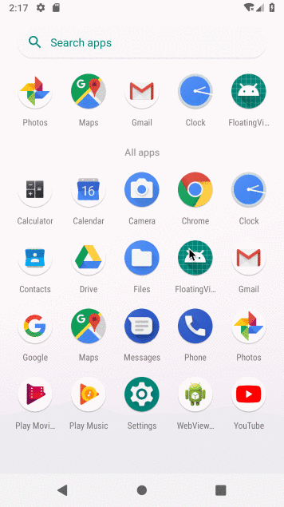

## 应用内悬浮窗-自动贴边
> 无需权限！！！
无需权限！！！
无需权限！！！


### 效果


> 实现原理：获取当前activity的DecorView然后find到android.R.id.content，addView自己的view。

获取当前activity的content
```
private FrameLayout getActivityRoot(Activity activity) {
        if (activity == null) {
            return null;
        }
        try {
            return (FrameLayout) activity.getWindow().getDecorView().findViewById(android.R.id.content);
        } catch (Exception e) {
            e.printStackTrace();
        }
        return null;
    }
```

### 实现方法

#### FloatingManage
> 主要为悬浮窗的管理类，包括设置头像、弹出内容、显示与隐藏。

#### FloatRootView、FloatView
> 主要为悬浮窗的页面布局和拖动、点按事件的监听操作的实现。


### 结果
> Demo已上传Github如需要可下载https://github.com/wangtaoT/FloatingView

